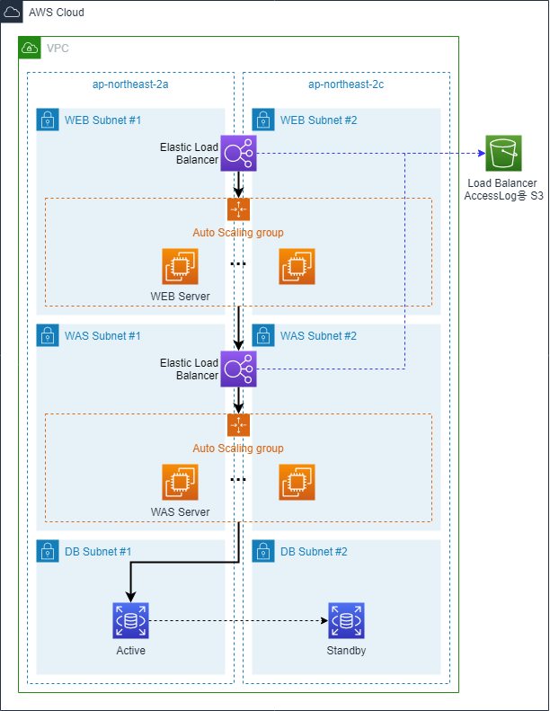

# [3-tier module]

## Requirements

|  Name | Version |
|------|---------|
|  [terraform](#requirement\_terraform) | >= 0.12.26 |
|  [aws](#requirement\_aws) | >= 3.15 |

## Providers

| Name | Version |
|------|---------|
|  [aws](#provider\_aws) | >= 3.15 |

## 개요

3-tier module은 3-tier용 환경에서 Auto Scaling 으로 WEB서버와 WAS 서버를 구성하고 RDS를 생성합니다.
  - Load Balancer를 생성
  - Auto Scaling 생성을 위한 Launch Template 또는 Launch Configuration을 생성
  - Auto Scaling Group을 생성
  - RDS MariaDB를 생성
  - 각 리스소가 통신 가능하도록 Security Group을 생성 및 업데이트 합니다.

### Architecture  

## 사용시 고려사항

### 실행환경
  - VPC가 사전에 생성되어 있어야 함
  - WEB용 Subnet, WAS용 Subnet과 DB Subnet이 사전에 구성되어 있어야 함
  - Load Balancer와 Auto Scaling Group을 연결하기 위해서는 Load Balancer Target Group을 EC2 type으로 생성해야 합니다.
  - Load Balancer에서 TLS나 HTTPS인증을 처리하기 위해서는 SSL인증서가 사전에 생성되어 있어야 함
  - Application Load Balancer를 생성하는 경우만 Security Group이 필요합니다.
  - RDS에 대한 Master 계정의 Password는 Parameter Store를 통해 랜덤하게 생성됨
  - RDS는 MariaDB로 생성됨
  - RDS 생성 시 신규 생성되는 RDS용 Security Group에 대해 WAS용 Security Group은 DB 포트로 inbound 및 outbound Rule이 업데이트 됩니다.

### 고려사항
  - Load Balancee를 생성 시 선택하는 type에 따라 input 값이 달라지게 됩니다.
  - Load Balancer의 Access Log 보관을 위한 S3 bucket은 사전에 생성되어 있어야 합니다.
  - Auto Scaling Group을 생성하기 위해 Launch Template이나 Launch Configuration 둘 중 하나를 선택하는 경우 필요한 input 값이 달라지게 됩니다.

